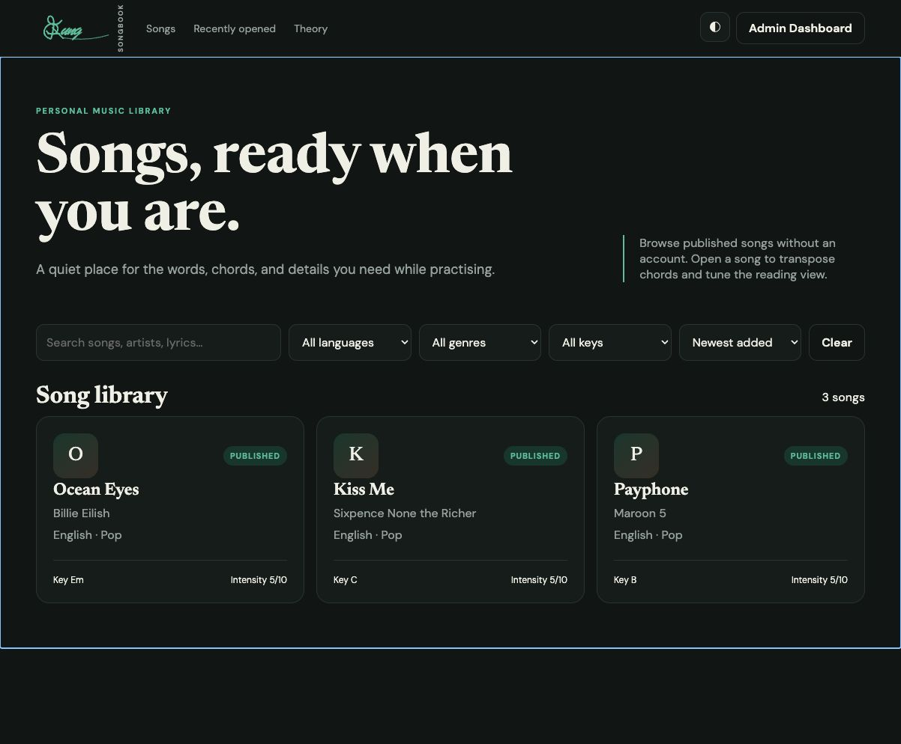
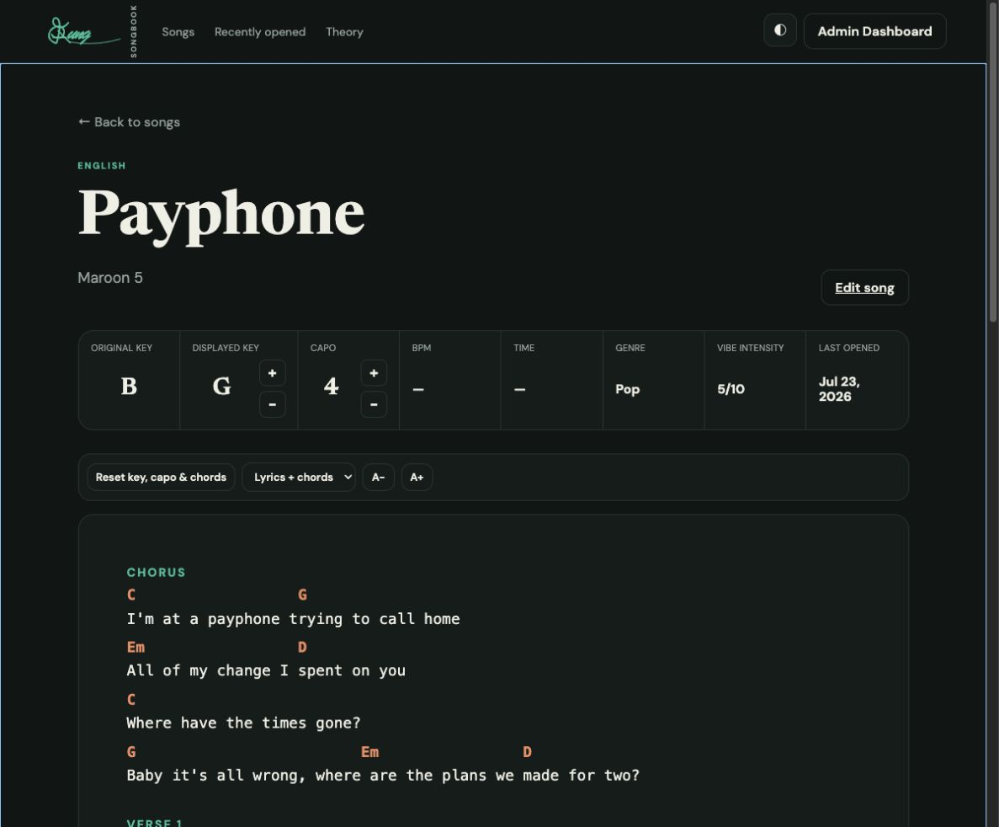
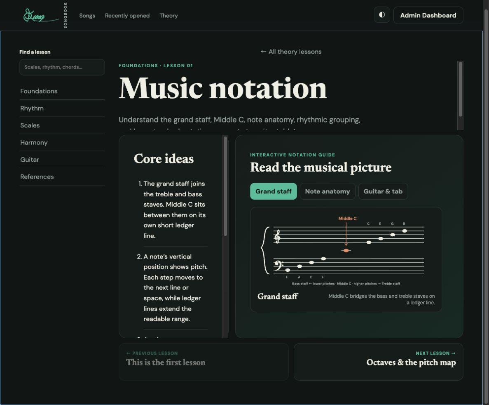
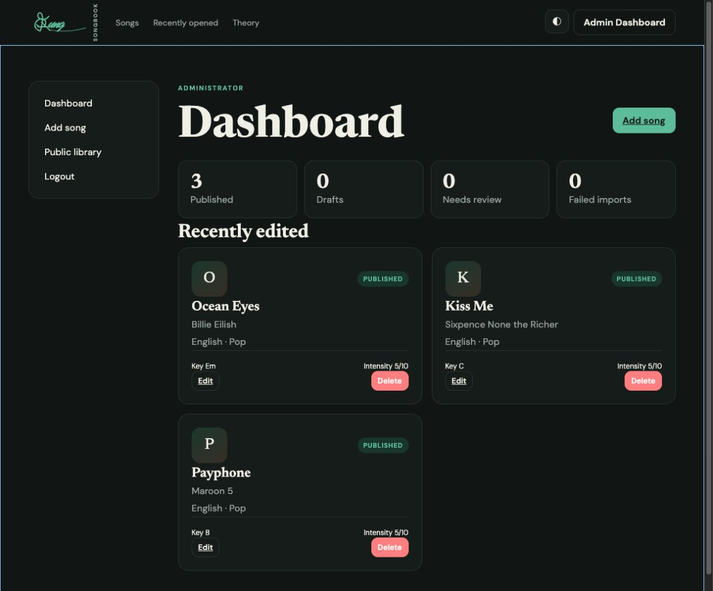

<div align="center">

# 𝄞 Aung Songbook

### Your songs. Your chords. Your music journey.

A calm, responsive space for collecting songs, practising lyrics and chords, and learning music theory.

[](https://nodejs.org/)
[](https://expressjs.com/)
[](https://www.sqlite.org/)
[](#-quality-checks)

[](https://aung-songbook.aminkhant1999.chatgpt.site)

[Screenshots](#-screenshots) · [Features](#-highlights) · [Quick start](#-quick-start) · [Song data](#-song-data--persistence) · [Deployment](#-deployment) · [API](#-api-overview)

</div>

---

> [!NOTE]
> **Recruiter or portfolio visitor?** Open the [live Aung Songbook web app](https://aung-songbook.aminkhant1999.chatgpt.site) directly in your browser. No download, installation, account, or local setup is required.

## 📸 Screenshots

| Song library | Chord reader |
| --- | --- |
| [](https://aung-songbook.aminkhant1999.chatgpt.site/#/?sort=added_new) | [](https://aung-songbook.aminkhant1999.chatgpt.site/#/song/payphone-maroon-5) |

| Interactive theory lesson | Secure admin workspace |
| --- | --- |
| [](https://aung-songbook.aminkhant1999.chatgpt.site/#/theory/notation) |  |

<div align="center">

Click a public screenshot to open that view in the live application.

</div>

## ✨ Highlights

| 🎵 Songbook | 🎸 Practice tools | 🎼 Theory |
| --- | --- | --- |
| Search, filter, sort, and publish songs | Transpose keys, chords, and capo together | Guided lessons from notation to guitar |
| Lyrics and chord-sheet importing | Lyrics, chords, or combined reading modes | Interactive scales, intervals, and chords |
| Secure administrator workspace | Adjustable, remembered reading size | Topic search and lesson-by-lesson navigation |

- Searchable song library with language, genre, key, and sorting controls
- Lyrics-only, chords-only, and combined reader modes
- Adjustable reading size with preferences remembered on the device
- Displayed-key and capo controls that move inversely and transpose every chord in the song
- One reset control that restores the song's original displayed key, capo, and chords
- Automatic conversion of pasted chord sheets into structured lyrics-and-chords JSON
- Draft, review, publish, unpublish, and recoverable soft-delete workflow
- Music-theory course with interactive notation, rhythm, scale, interval, chord, and guitar lessons
- Lesson search, topic navigation, and previous/next lesson controls
- Responsive light and dark themes with accessible navigation and focus states

> [!TIP]
> Visitors can browse published songs without an account. Sign in only when you need to add, edit, or publish content.

## 🧰 Technology

`Node.js 22+` · `Express 5` · `Vanilla JavaScript` · `SQLite` · `bcrypt` · `Supertest` · `ESLint`

## 🗂️ Project structure

```text
AungSongBook/
├── client/                 Browser interface and theory lessons
├── server/
│   ├── app.js              Express application and API routes
│   ├── db.js               SQLite schema, connection, and backups
│   ├── repository.js       Song persistence and queries
│   ├── security.js         Authentication and sessions
│   └── music.js            Chord transposition utilities
├── scripts/build.js        Production client build
└── test/                   Workflow, parser, API, and security tests
```

## 🚀 Quick start

### 1 · Install

```bash
git clone https://github.com/aminkhant1999/AungSongBook.git
cd AungSongBook
npm install
```

### 2 · Configure

```bash
cp .env.example .env
npm run hash-password
```

Add the generated hash to `ADMIN_PASSWORD_HASH` in `.env`, then set `SESSION_SECRET` to a random value of at least 32 characters.

### 3 · Run

```bash
npm run dev
```

Open **[localhost:3000](http://localhost:3000)**. The SQLite database is created automatically at the configured `DATABASE_URL`.

## 🔐 Environment variables

| Variable | Description |
| --- | --- |
| `NODE_ENV` | `development`, `test`, or `production` |
| `PORT` | HTTP port; defaults to `3000` |
| `DATABASE_URL` | SQLite database path; defaults to `./data/songbook.db` |
| `CLIENT_URL` | Exact permitted browser origin |
| `ADMIN_USERNAME` | Administrator login name |
| `ADMIN_PASSWORD_HASH` | bcrypt password hash; never store the plain password |
| `SESSION_SECRET` | Random session-signing value with at least 32 characters |
| `OPENAI_API_KEY` | Optional metadata-assistance key |
| `LYRICS_PROVIDER_API_KEY` | Reserved for a properly licensed lyrics provider |
| `CHORD_PROVIDER_API_KEY` | Reserved for a properly licensed chord provider |

> [!CAUTION]
> Never commit `.env`, production credentials, password hashes, or the `data/` directory.

## 💾 Song data & persistence

Songs are stored in SQLite rather than browser storage, so restarting or refreshing the app does not remove them. The configured database directory must be on persistent storage in production.

After song creation, editing, deletion, or publication changes, the app writes a recoverable snapshot to:

```text
data/backups/songbook-latest.db
```

The database and backup directory are intentionally excluded from Git. Back them up separately when moving the app to another computer or host.

### ✍️ Importing a chord sheet

In the administrator editor, paste a complete chord sheet into **Plain lyrics for search / chord-sheet import**. Section headings such as `[Intro]`, `[Verse 1]`, and `[Chorus]`, together with chord rows, are parsed automatically into the structured JSON field.

Structured content follows this shape:

```json
{
  "sections": [
    {
      "type": "verse",
      "label": "Verse 1",
      "lines": [
        {
          "lyrics": "An authorised lyric line",
          "chords": [
            { "chord": "C", "position": 0 },
            { "chord": "G", "position": 12 }
          ]
        }
      ]
    }
  ]
}
```

Always review the generated alignment before publishing.

## ⌨️ Commands

| Command | Purpose |
| --- | --- |
| `npm run dev` | Start the server in watch mode |
| `npm start` | Start the production server |
| `npm run build` | Build the production client in `dist/client` |
| `npm run lint` | Run static code checks |
| `npm test` | Run the automated test suite |
| `npm run seed` | Safely create any missing seed records |
| `npm run hash-password` | Generate a bcrypt administrator password hash |

## ✅ Quality checks

Run the complete verification sequence before a release:

```bash
npm run lint
npm run build
npm test
```

The current suite covers public browsing, authentication, administrator workflows, validation, rate limiting, chord transposition, chord-sheet parsing, and secret protection.

## ☁️ Deployment

<details>
<summary><strong>Deploy with Render</strong></summary>

The included `render.yaml` defines a Node web service with a persistent disk for SQLite.

1. Push the repository to GitHub.
2. Create a Render Blueprint from `render.yaml`.
3. Configure `ADMIN_USERNAME`, `ADMIN_PASSWORD_HASH`, and `CLIENT_URL`.
4. Let Render generate `SESSION_SECRET`.
5. Deploy and verify `/api/health`, public song browsing, administrator login, and a song edit.

Keep a single application instance while using SQLite. Use PostgreSQL or another shared database before horizontally scaling.

</details>

<details>
<summary><strong>Deploy with Docker</strong></summary>

Build with the included `Dockerfile`, mount persistent storage at `/app/data`, and provide the same environment variables.

> Without a persistent volume, song data will disappear when the container is replaced.

</details>

## 🔌 API overview

| Area | Routes |
| --- | --- |
| Public | `GET /api/health` · `GET /api/songs` · `GET /api/songs/:slug` · `POST /api/songs/:id/open` · `GET /api/filters` |
| Authentication | `POST /api/auth/login` · `POST /api/auth/logout` · `GET /api/auth/session` |
| Administration | Protected song, dashboard, publication, suggestion, and job routes under `/api/admin` |

## 🛡️ Security & content

- Authentication cookies are HTTP-only and SameSite protected.
- Write endpoints require an authenticated administrator session.
- Login attempts are rate-limited.
- Input is validated and sanitised before persistence.
- Add or publish lyrics and chord arrangements only when you have permission to store and display them.

### Secure hosted editing

The portfolio deployment keeps public reading and private editing separate:

- Published songs and theory lessons remain available to every visitor.
- The owner can select **Admin sign in** and authenticate with ChatGPT to add, edit, publish, or remove songs directly in the browser.
- Server-side authorization restricts every `/api/admin` write route to the verified owner account.
- Hosted songs are stored in the managed D1 database and survive deployments, browser changes, and local-computer changes.
- No administrator password, password hash, session secret, `.env` file, or SQLite backup is included in the deployed bundle.
- Deletes remain soft deletes in the hosted database rather than immediately erasing the record.

The local SQLite workflow remains available for development. Publishing this repository does not publish the local `.env` or `data/` directory because both are excluded by `.gitignore`.

## 🩺 Troubleshooting

- **Login is unavailable:** set both `ADMIN_PASSWORD_HASH` and `SESSION_SECRET`, then restart.
- **Database cannot open:** make sure the parent directory of `DATABASE_URL` exists and is writable.
- **Songs disappear after deployment:** mount persistent storage and point `DATABASE_URL` to it.
- **A draft is missing from the public library:** publish it from the administrator dashboard.
- **Browser requests are rejected:** set `CLIENT_URL` to the exact deployed origin, including `https://`.

## 📜 Licence

This is a personal-use application. No licence is granted for third-party song lyrics, chord arrangements, or referenced educational material.

---

<div align="center">

Made for quieter practice sessions, one song at a time. 🎶

</div>
